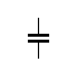
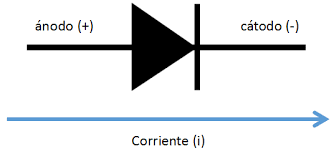
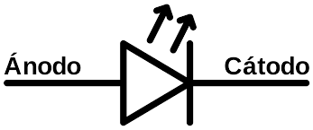

# Electrónica Básica
## Estos son algunos de los componentes electrónicos que se suelen usar dentro de un circuito eléctrico y sus formas de representarlos en un circuito:
Resistencias fijas/variables:

Condensadores:

Diódos

Ledes

Transistores

## Para que sirven estos componentes

Resistencias: Las resistencias sirven para regular y estabilizar el flujo de corriente eléctrica, proteger componentes sensibles de daños por sobrevoltaje, dividir el voltaje en un circuito y generar calor

Condensadores: Los condensadores sirven para almacenar energía en forma de campo eléctrico y para suavizar fluctuaciones de voltaje en circuitos

Diódos: Los diodos sirven principalmente para permitir el paso de la corriente eléctrica en un solo sentido

Ledes: Los ledes sirven para iluminar (hogares, oficinas, exteriores), como indicadores de estado en aparatos electrónicos y en pantallas (televisores, móviles)

Transistores: Los transistores sirven para amplificar o conmutar señales eléctricas, actuando como interruptores controlados o como amplificadores de corriente.

## Funcionamiento interno

Resistencias: Una resistencia funciona limitando el flujo de electrones al oponerse a la corriente eléctrica y convertir la energía eléctrica en calor

Condensadores: Un condensador almacena energía eléctrica en un campo eléctrico entre dos placas conductoras separadas por un material aislante (dieléctrico). Cuando se conecta a una fuente de voltaje, una placa se carga negativamente y la otra positivamente, y el condensador almacena energía hasta que alcanza el voltaje de la fuente. Al desconectar la fuente, puede liberar la energía rápidamente si se conecta una carga

Diódos: Un diodo funciona como una válvula unidireccional para la corriente eléctrica, permitiendo el flujo en una dirección (polarización directa) y bloqueándolo en la dirección opuesta (polarización inversa)

Ledes: Un LED funciona cuando se aplica un voltaje directo, haciendo que los electrones y los "huecos" en un material semiconductor se combinen y liberen energía en forma de fotones (luz)

Transistores: Un transistor funciona controlando el flujo de corriente entre dos terminales (emisor y colector) mediante una pequeña señal aplicada a un tercer terminal (la base)

## Símbolo eléctrico

Resistencia: 

Condensador:

Diódo: 

Led: 

Transistores:

