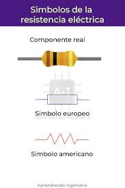
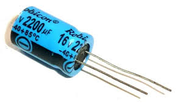
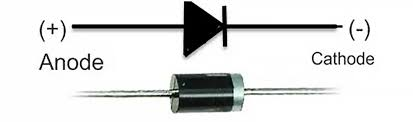
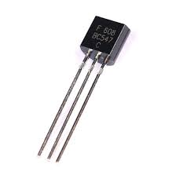

# Electrónica Básica
## Estos son algunos de los componentes electrónicos que se suelen usar dentro de un circuito eléctrico y sus formas de representarlos en un circuito:
Resistencias fijas/variables:

Condensadores:

Diódos

Ledes

Transistores

## Para que sirven estos componentes

Resistencias: Las resistencias sirven para regular y estabilizar el flujo de corriente eléctrica, proteger componentes sensibles de daños por sobrevoltaje, dividir el voltaje en un circuito y generar calor

Condensadores: Los condensadores sirven para almacenar energía en forma de campo eléctrico y para suavizar fluctuaciones de voltaje en circuitos

Diódos: Los diodos sirven principalmente para permitir el paso de la corriente eléctrica en un solo sentido

Ledes: Los ledes sirven para iluminar (hogares, oficinas, exteriores), como indicadores de estado en aparatos electrónicos y en pantallas (televisores, móviles)

Transistores: Los transistores sirven para amplificar o conmutar señales eléctricas, actuando como interruptores controlados o como amplificadores de corriente.

## Funcionamiento interno

Resistencias: Una resistencia funciona limitando el flujo de electrones al oponerse a la corriente eléctrica y convertir la energía eléctrica en calor

Condensadores: Un condensador almacena energía eléctrica en un campo eléctrico entre dos placas conductoras separadas por un material aislante (dieléctrico). Cuando se conecta a una fuente de voltaje, una placa se carga negativamente y la otra positivamente, y el condensador almacena energía hasta que alcanza el voltaje de la fuente. Al desconectar la fuente, puede liberar la energía rápidamente si se conecta una carga

Diódos: Un diodo funciona como una válvula unidireccional para la corriente eléctrica, permitiendo el flujo en una dirección (polarización directa) y bloqueándolo en la dirección opuesta (polarización inversa)

Ledes: Un LED funciona cuando se aplica un voltaje directo, haciendo que los electrones y los "huecos" en un material semiconductor se combinen y liberen energía en forma de fotones (luz)

Transistores: Un transistor funciona controlando el flujo de corriente entre dos terminales (emisor y colector) mediante una pequeña señal aplicada a un tercer terminal (la base)

## Símbolo eléctrico

Resistencia: 

Condensador:

Diódo: 

Led: 

Transistores:

## Imagen Real

Resistencia: 

Condensador:

Diódo: 

Led: 

Transistores:

## Algunas aplicaciones de uso

Resistencia: Las resistencias tienen aplicaciones como limitar la corriente para proteger componentes sensibles como los LED, dividir el voltaje en circuitos (divisores de voltaje), y actuar como calefactores en electrodomésticos y sistemas industriales

Condensadores: Los condensadores tienen múltiples aplicaciones, incluyendo almacenamiento de energía (como en los flashes de cámaras o desfibriladores), filtrado de ruido en fuentes de alimentación y equipos de audio, sintonización de frecuencias en radios y televisores, arranque de motores (especialmente los monofásicos) y corrección del factor de potencia en instalaciones industriales para reducir el consumo reactivo

Diódo: Los diodos tienen muchas aplicaciones, como rectificación (convertir corriente alterna en continua) en fuentes de alimentación, iluminación (diodos LED), y protección (evitar que la corriente circule en la dirección incorrecta o contra sobretensiones)

Led: Las aplicaciones de un LED incluyen la iluminación (doméstica, exterior y decorativa), pantallas (televisores, monitores, teléfonos móviles, vallas publicitarias) y señalización (indicadores de estado, semáforos, paneles de información en transporte). También se usan en el sector automotriz (luces de freno, faros), médico (terapia de luz, equipos) y en agricultura (cultivo de plantas). 

Transistores: Los transistores se usan para amplificar señales (en radios, televisores y equipos de audio) y para conmutar (encender o apagar) en circuitos digitales como los de computadoras y teléfonos, reguladores de voltaje y controladores de motores

## Variedades de los componentes

Resistencias:

Condensadores:

Diódo:

Led

Transistores: 
