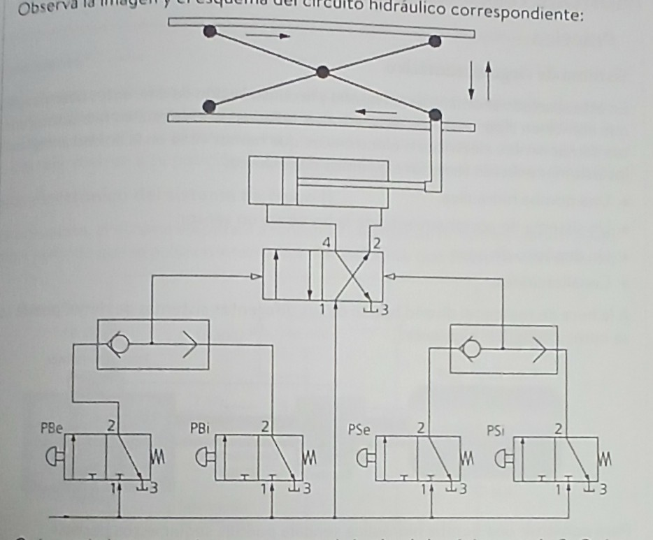

# Mecánica

En clase de Tecnología acabamos de dar los circuitos mecanicos, y ahora tenemos una tarea que es describir este circuito en cuestión

-Vamos a empezar por abajo, donde nos encontramos 4 válvulas 2/3, que depende de cual pulsemos la valvula selectora hará una cosa u otra (hay dos válvulas selectoras) si pulsamos el pulsador de la primera valvula que hay a la izquierda el aire pasará a una válvula 2/4, y ahora explicamos más

- Siguiendo con la explicación, tenemos la válvula 2/4 en la que si le viene el aire o el liquido que empuje el vástago y el émbolo, desde las valvulas 2/3 1ra y 2da harán que el vástago y el émbolo se mueva hacia la derecha, con lo cual la plataforma bajará, pero si de la misma forma el aire o liquido vienen por las válvulas 2/3 3ra y 4ta harán que el vástago y el émbolo se muevan hacia la izquierda, provocando que la plataforma suba, por lo cual 

## Progrmación con Arduino

Ahora que hemos terminado con la neumatica vamos a programar un poco con arduino. Primero hemos hecho un programa en el que un diódo LED se encediera y se apagara, como si fuera un intermitente. Teniendo ese circuito y esa programación hecha pasamos a la siguiente programación que vamos a hacer.

La siguiente programación que hemos hecho es una en la que un sensor PIR (Es un sensor de movimiento) detecta si hay presencia y si hay presencia un LED se enciende, sin embargo si el sensor PIR no detecta a ninguna persona no se enciende el LED. Cabe aclarar que como esto lo estamos haciendo con Arduino también hemos hecho que nos ponga en el monitor serie de la aplicación si hay movimiento o si no hay movimiento. 
El resumen de esto se puede ver en el video que hay abajo

