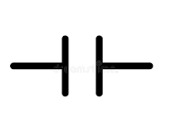
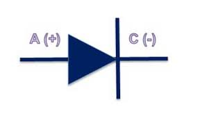
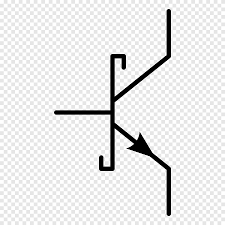

# Electrónica Básica
## Estos son algunos de los componentes electrónicos que se suelen usar dentro de un circuito eléctrico y sus formas de representarlos en un circuito:
Resistencias fijas/variables:

Condensadores:

Diódos

Ledes

Transistores

