# Cuaderno tecnología 4º ESO
**Estoy escribiendo en negrita**
*Esto es en cursiva*
**Esto es en _negrita_ pero con una parte cursiva** 
Cuaderno de clase para la asignatura de tecnologia de 4º ESO con todos los proyectos que vamos a hacer durante el curso

#Estado del mapa

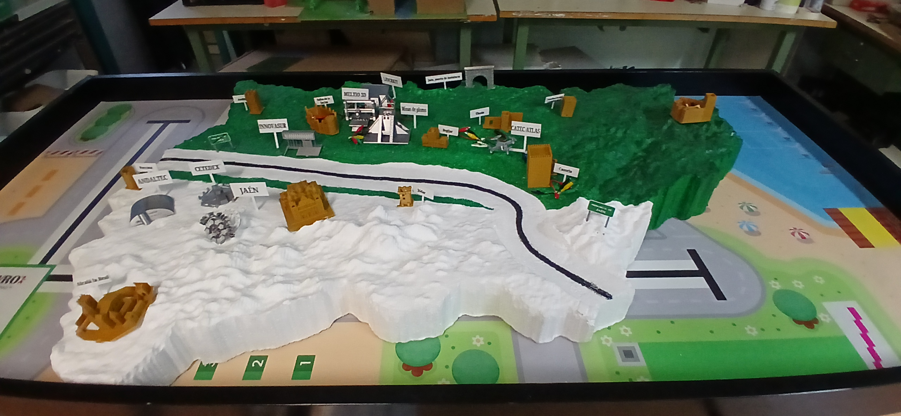

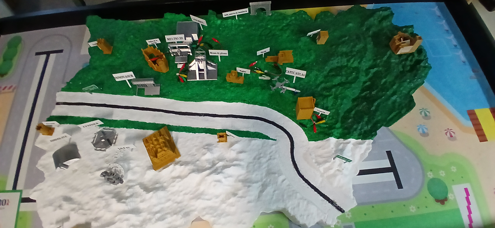

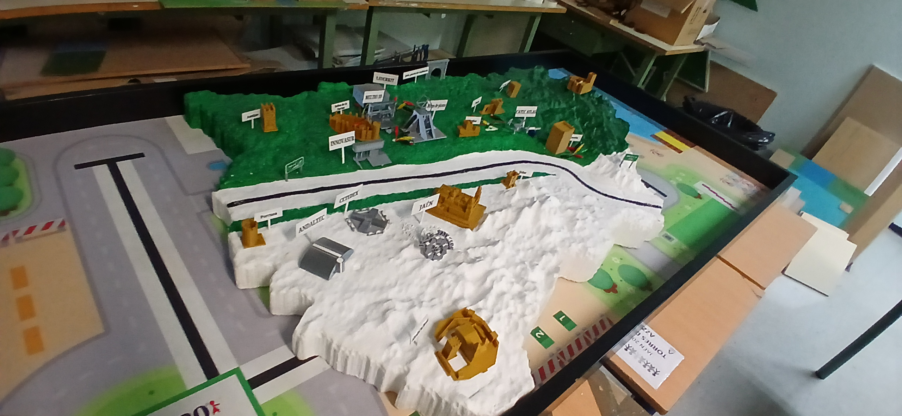

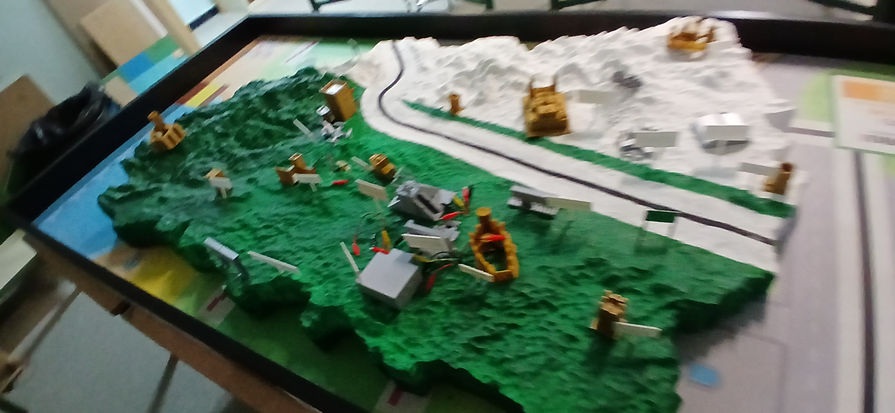

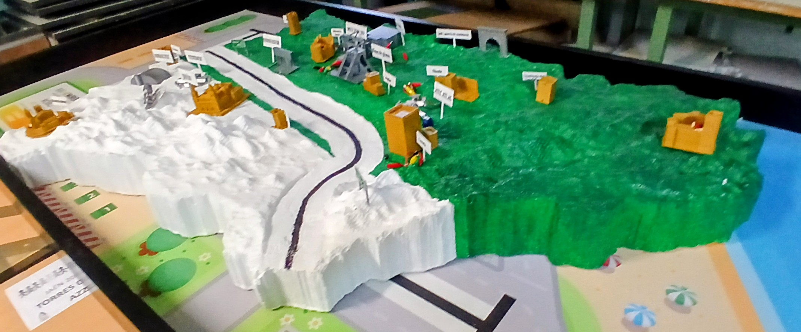
**Posible** solución para el invernadero
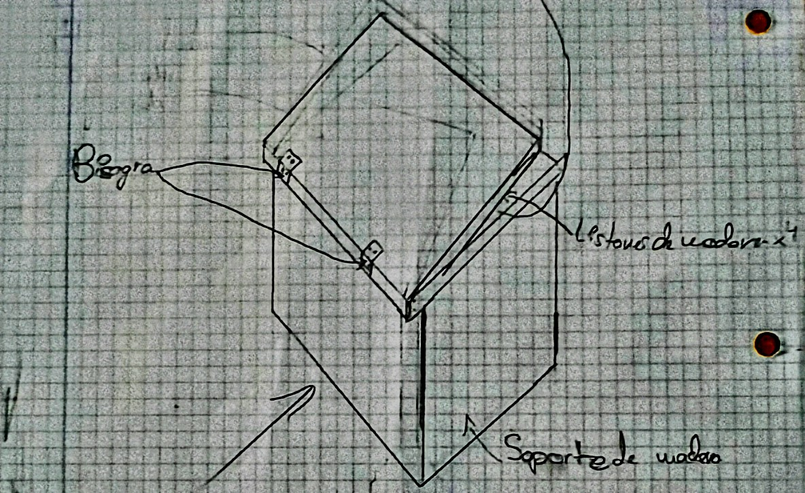

#Estado del invernadero
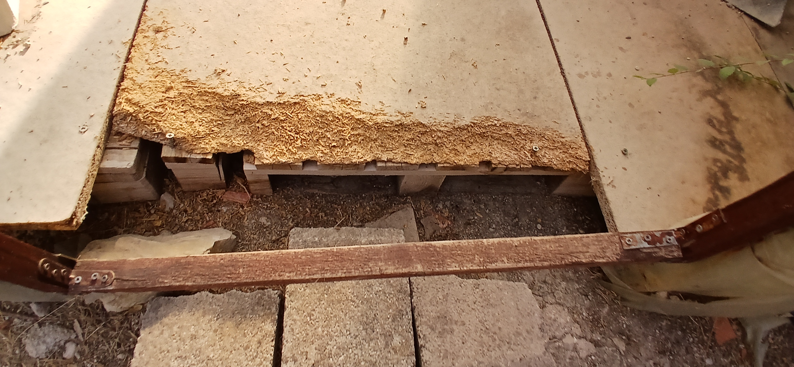
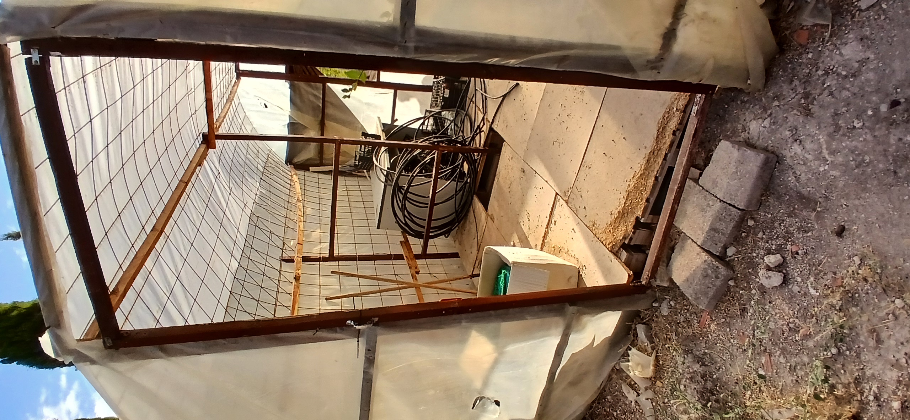
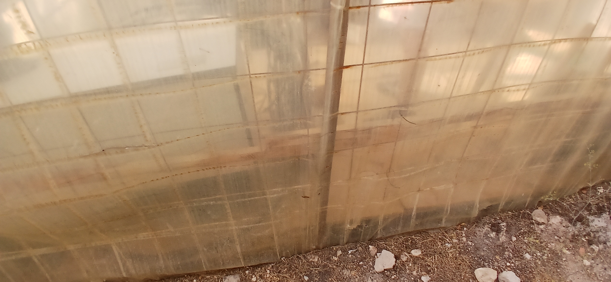
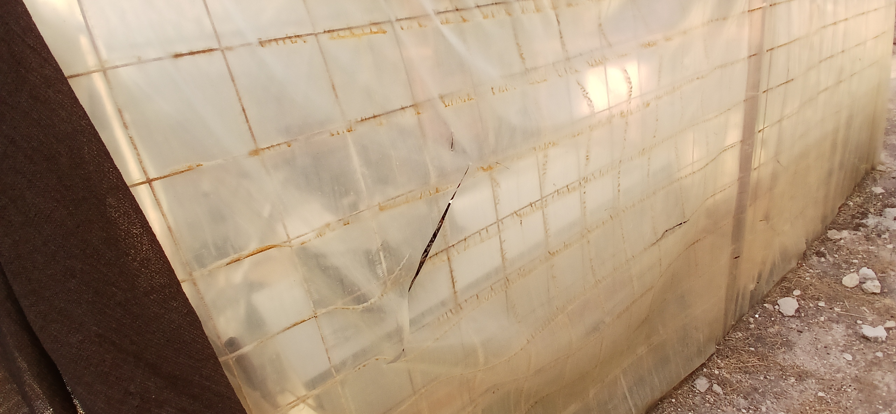
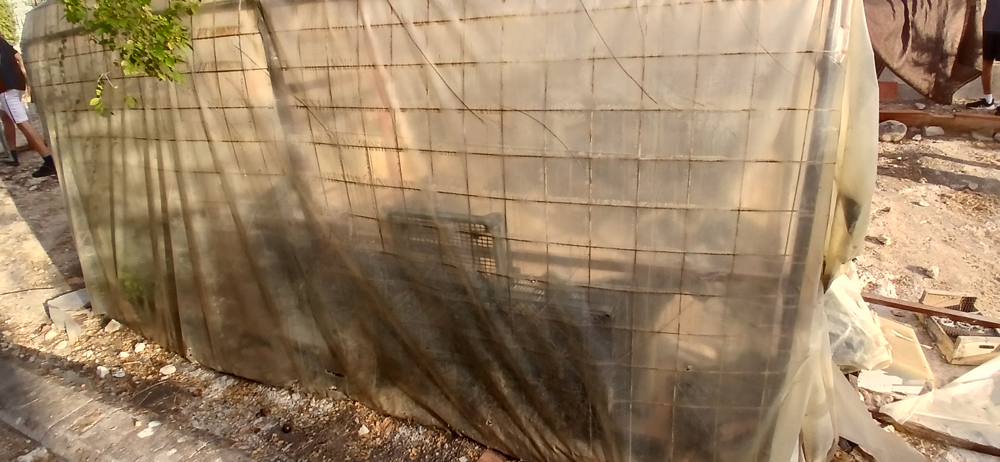
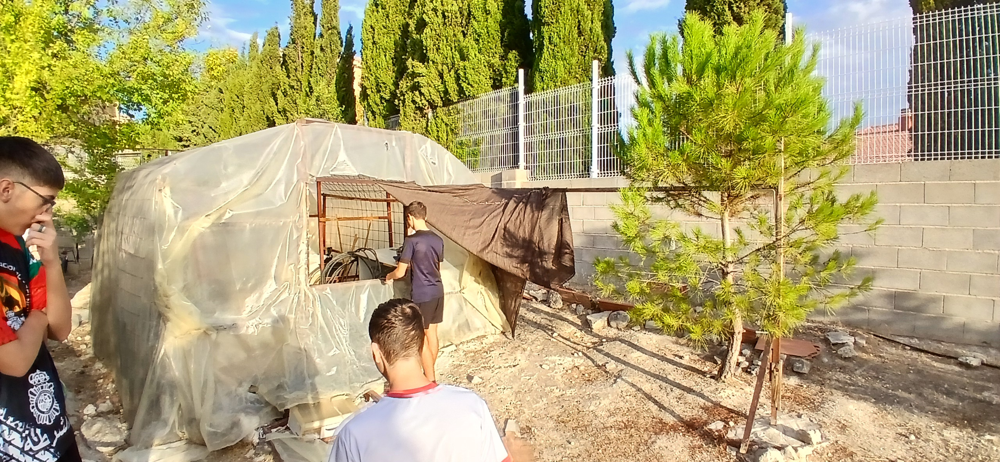
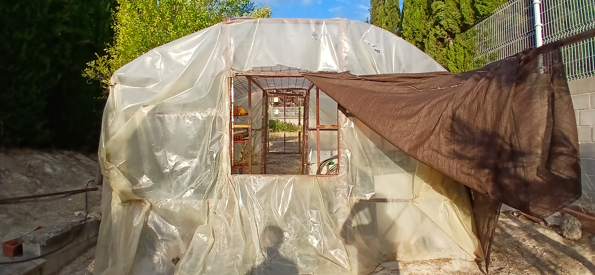
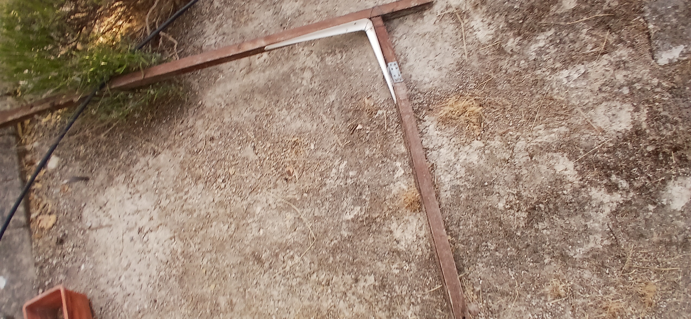
Todas estas imágenes
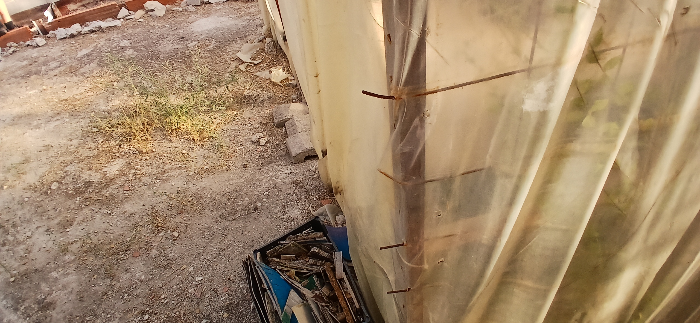
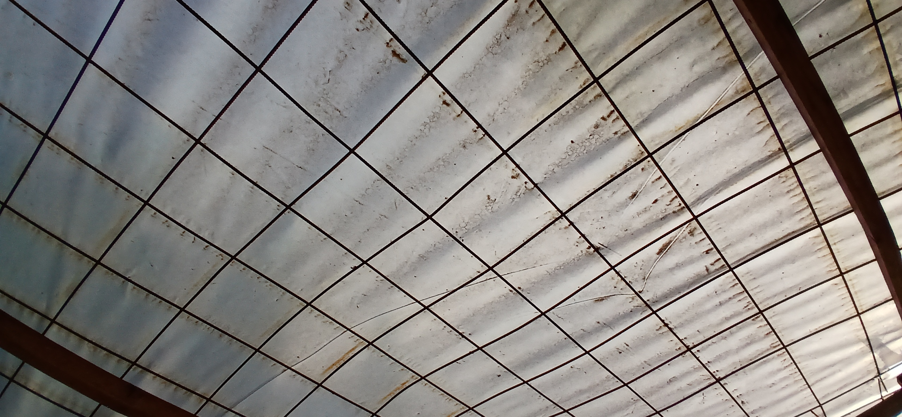
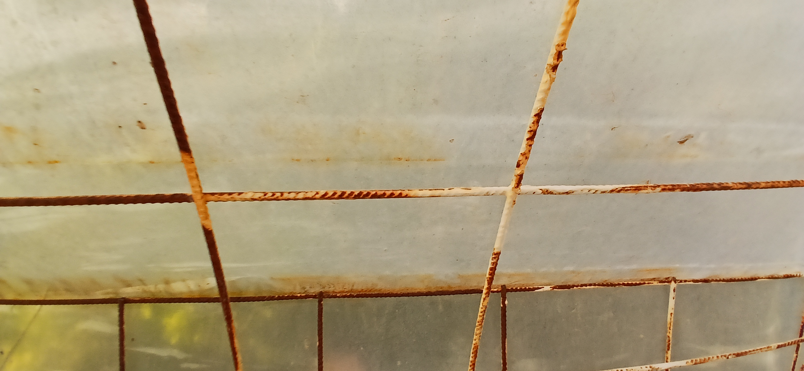
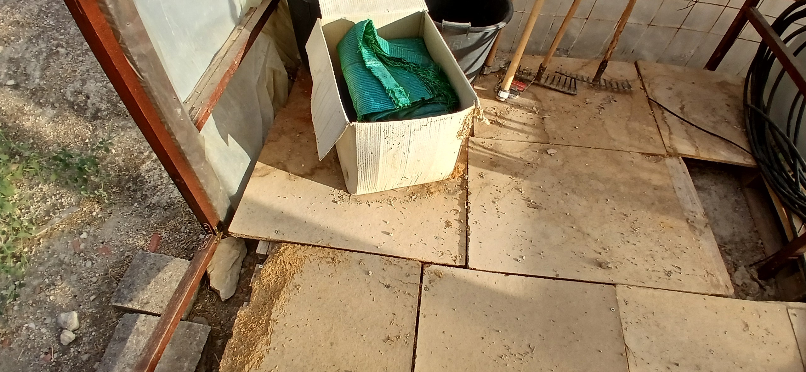
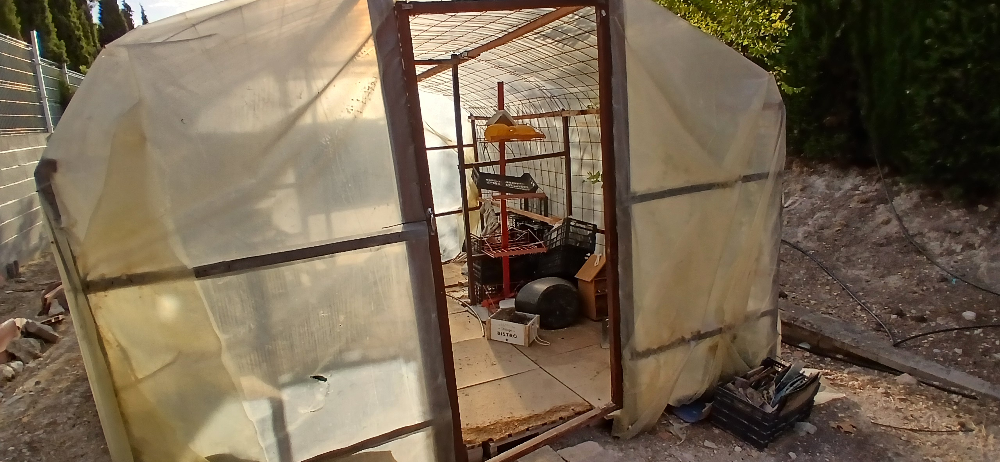
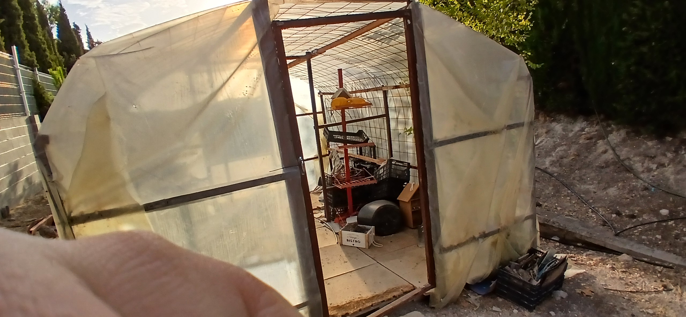
