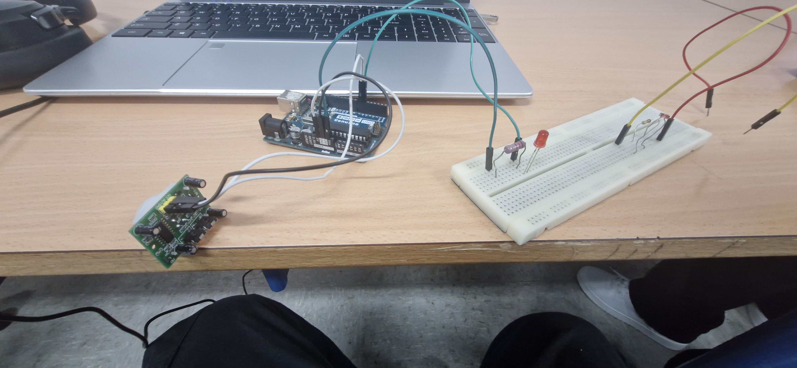
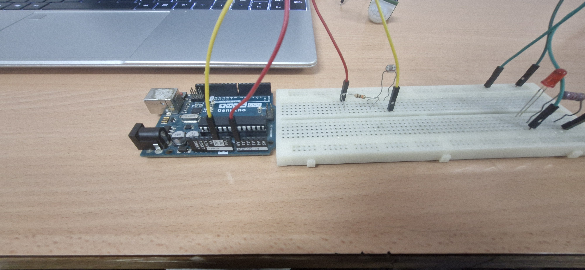
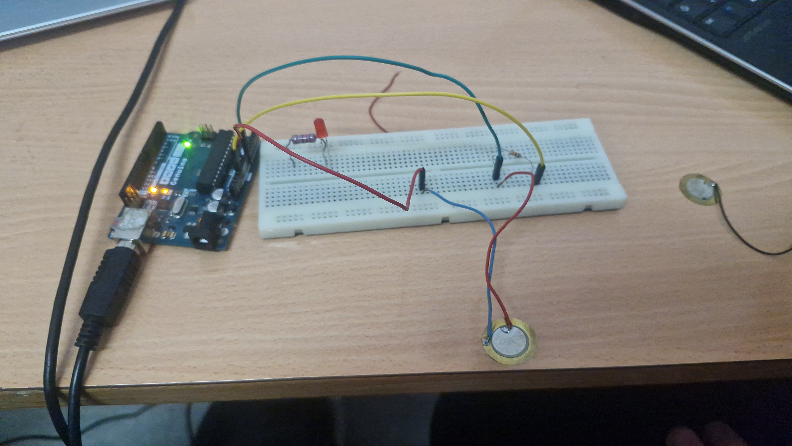
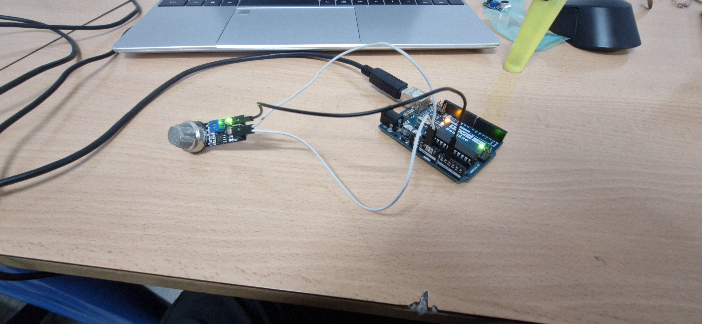

## Programación con Arduino

Vamos a empezar a programar con Arduino. Primero hemos hecho un programa en el que un diódo LED se encediera y se apagara, como si fuera un intermitente. Teniendo ese circuito y esa programación hecha pasamos a la siguiente programación que vamos a hacer.

----------------------------------------------------------------------------------------------------------------------------------------------------------------------------------------------------------------

La siguiente programación que hemos hecho es una en la que un sensor PIR (Es un sensor de movimiento) detecta si hay presencia y si hay presencia un LED se enciende, sin embargo si el sensor PIR no detecta a ninguna persona no se enciende el LED. Cabe aclarar que como esto lo estamos haciendo con Arduino también hemos hecho que nos ponga en el monitor serie de la aplicación si hay movimiento o si no hay movimiento. 
El resumen de esto se puede ver en el video que hay abajo

Además de esto esta es una imágen del montaje de este circuito

----------------------------------------------------------------------------------------------------------------------------------------------------------------------------------------------------------------

Después de esta prueba de programación, en mi grupo hemos elaborado un programa utilizado para ver la señal que nos llega de una LDR, me explico mejor. Hemos hecho que de una LDR lleguen datos como diciendo la cantidad de luz que recibe y deja de recibir, cosa que se veia en el monitor serie que está disponible en el mismo programa de Arduino
Video a continuación en el que se ve el rpgrama que he explicado.

Nosotros teniamos la LDR conectada a la placa de pruebas y a Arduino a través de unos cables y una resistencia, en la imagen siguiente se ve las conexiones que hicimos

En esta imágen que hay debajo se puede ver el programa, que explicaré a continuación de esta

En primer lugar vamos a crear tres variables, una en la que se diga donde está nuestra LDR, otra variable llamada entrada en la que vemos el valor que nos da la LDR en el monitor serie y otra variable, que ahora mismo no recuerdo bien. Después de esto está nuesttro void setup, en el que le decimos al programa si el pin en el que estamos es, de lectura o escritura, si es analógica (muchos valores posibles) o digital (solo dos posibles valores) y si queremos que se vea algo en el monitor serie a que velocidad, en Baudios, se pasan los datos desde que se reciben hasta que se llega a la placa Arduino
Después tenemos nuestro void loop, que es lo que ejecuta nuestro programa, aqui decimos que la variable entrada es la lectura analógica de el pin en el que tenemos conectada nuestra LDR (en nuestro caso el A1)
Despues ponemos que lo que se reciba en la placa nos lo ponga en el monitor serie, y que haya un retraso de 0,1 segundo en lo que se muestran los datos que recibimos en el monitor serie

------------------------------------------------------------------------------------------------------------------------------------------------------------------------------------------------------------------

#### Sensor de presión

Después de la LDR tenemos el sensor de presión, en el que tenemos el mismo código que en el programa anterior pero añadiendo el mapeo de este sensor. A continuación la imágen de este montaje:

-------------------------------------------------------------------------------------------------------------------------------------------------------------------------------------------------------------

# Sensores de gas y de sonido.

El primer video y foto son el sensor de sonido y su funcionamento, además como el código es el mismo no hace falta que ponga otra vez el código

#### Código programas sensores

Vídeo funcionamento sensor sonido:

Imagen conexiones sensor sonido:

Vídeo funcionamento sensor de gas:

Imagen conexiones sensor de gas:

Después de esto explico un poco. Estos sensores tienen el mismo código que los sensores anteriores, haciendo asi que tengamos la misma funcion pero con diferentes sensores, la diferencia es que en el de gas detectamos una cosa y en el sensor de sonido detectamos otra cosa
