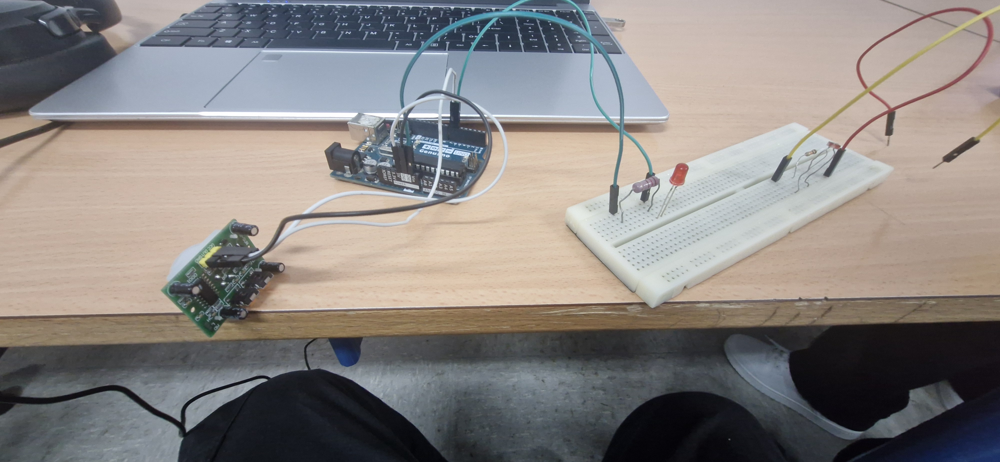
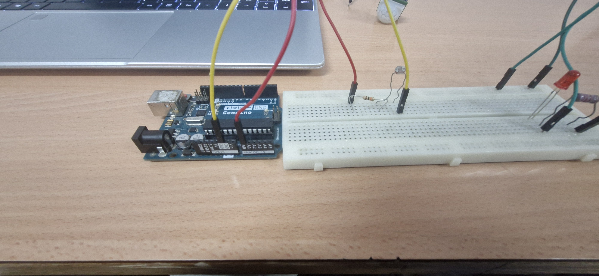
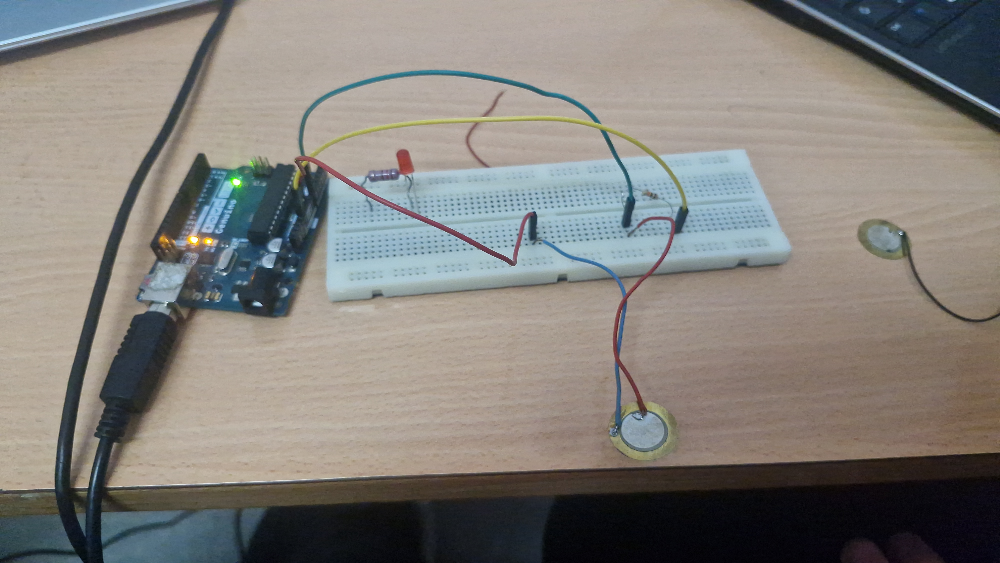
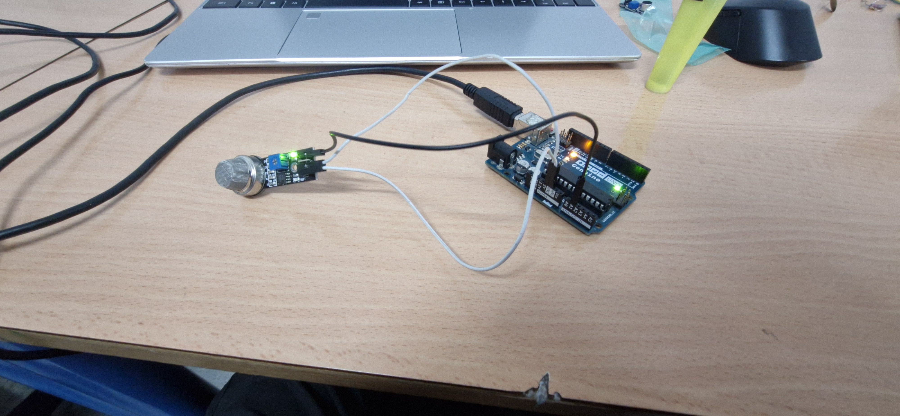
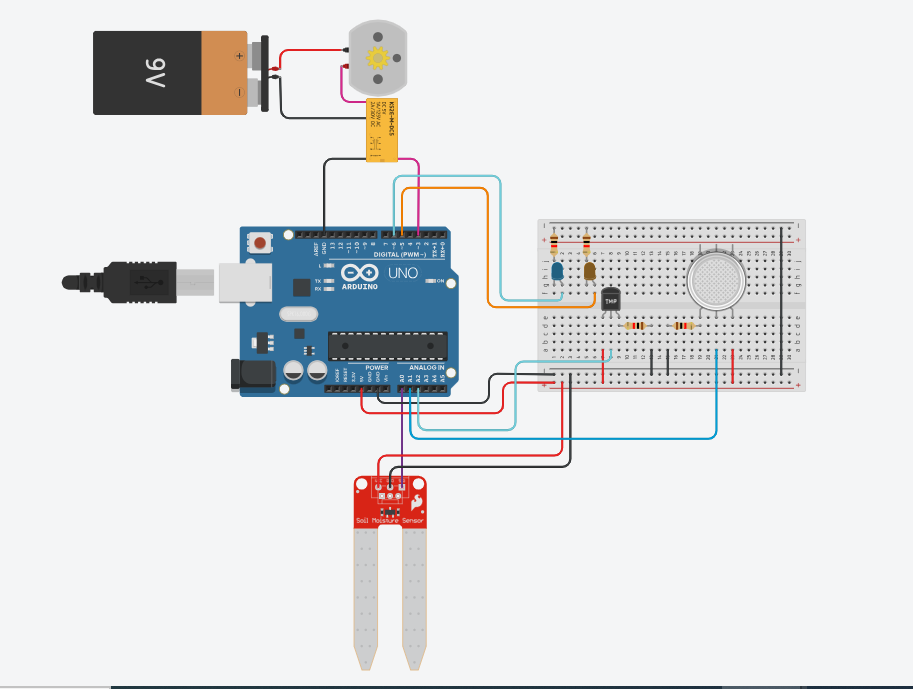

## Programación con Arduino

Vamos a empezar a programar con Arduino. Primero hemos hecho un programa en el que un diódo LED se encediera y se apagara, como si fuera un intermitente. Teniendo ese circuito y esa programación hecha pasamos a la siguiente programación que vamos a hacer.

----------------------------------------------------------------------------------------------------------------------------------------------------------------------------------------------------------------

La siguiente programación que hemos hecho es una en la que un sensor PIR (Es un sensor de movimiento) detecta si hay presencia y si hay presencia un LED se enciende, sin embargo si el sensor PIR no detecta a ninguna persona no se enciende el LED. Cabe aclarar que como esto lo estamos haciendo con Arduino también hemos hecho que nos ponga en el monitor serie de la aplicación si hay movimiento o si no hay movimiento. 
El resumen de esto se puede ver en el video que hay abajo

Además de esto esta es una imágen del montaje de este circuito

----------------------------------------------------------------------------------------------------------------------------------------------------------------------------------------------------------------

Después de esta prueba de programación, en mi grupo hemos elaborado un programa utilizado para ver la señal que nos llega de una LDR, me explico mejor. Hemos hecho que de una LDR lleguen datos como diciendo la cantidad de luz que recibe y deja de recibir, cosa que se veia en el monitor serie que está disponible en el mismo programa de Arduino
Video a continuación en el que se ve el rpgrama que he explicado.

Nosotros teniamos la LDR conectada a la placa de pruebas y a Arduino a través de unos cables y una resistencia, en la imagen siguiente se ve las conexiones que hicimos

En esta imágen que hay debajo se puede ver el programa, que explicaré a continuación de esta

En primer lugar vamos a crear tres variables, una en la que se diga donde está nuestra LDR, otra variable llamada entrada en la que vemos el valor que nos da la LDR en el monitor serie y otra variable, que ahora mismo no recuerdo bien. Después de esto está nuesttro void setup, en el que le decimos al programa si el pin en el que estamos es, de lectura o escritura, si es analógica (muchos valores posibles) o digital (solo dos posibles valores) y si queremos que se vea algo en el monitor serie a que velocidad, en Baudios, se pasan los datos desde que se reciben hasta que se llega a la placa Arduino
Después tenemos nuestro void loop, que es lo que ejecuta nuestro programa, aqui decimos que la variable entrada es la lectura analógica de el pin en el que tenemos conectada nuestra LDR (en nuestro caso el A1)
Despues ponemos que lo que se reciba en la placa nos lo ponga en el monitor serie, y que haya un retraso de 0,1 segundo en lo que se muestran los datos que recibimos en el monitor serie

------------------------------------------------------------------------------------------------------------------------------------------------------------------------------------------------------------------

#### Sensor de presión

Después de la LDR tenemos el sensor de presión, en el que tenemos el mismo código que en el programa anterior pero añadiendo el mapeo de este sensor. A continuación la imágen de este montaje:

-------------------------------------------------------------------------------------------------------------------------------------------------------------------------------------------------------------

# Sensores de gas y de sonido.

El primer video y foto son el sensor de sonido y su funcionamento, además como el código es el mismo no hace falta que ponga otra vez el código

#### Código programas sensores

Vídeo funcionamento sensor sonido:

Imagen conexiones sensor sonido:

Vídeo funcionamento sensor de gas:

Imagen conexiones sensor de gas:

Después de esto explico un poco. Estos sensores tienen el mismo código que los sensores anteriores, haciendo asi que tengamos la misma funcion pero con diferentes sensores, la diferencia es que en el de gas detectamos una cosa y en el sensor de sonido detectamos otra cosa

-----------------------------------------------------------------------------------------------------------------------------------------------------------------------------------------------------------------

## Propuesta Invernadero

Ya que hemos hecho todos estos sensores ahora vamos a hacer un invernadero para la competición TELECOGAMES. ¿Cómo lo vamos a hacer? A través de diseños 3D que nosotros mismos hemos diseñado en Tinkercad y que hemos impreso en una impresora 3D para después montar toda la estructura del invernadero.

Yo como propuesta mia he hecho unas vigas para la parte de abajo para que así agarren los pilares y que no sea una estructura tan fácil de tirar, aquí abajo se muestra unas imágenes de mi diseño

Esta es mi parte de las bases del invernadero que me han tocado hacer, bases 1B y 1C

Las bases sirven como su propio nombre indica como una base para las columnas de nuestro invernadero y que no se caigan las columnas del invernadero provocando así que el invernadero entero se caiga y tengamos la posibilidad de que se nos mueran las plantas o múltiples cosas de ese tipo que les puedan pasar a las plantas

Así es como queda la estructura del invernadero una vez montado, ya solo faltaría ponerle algún plastico para que cumpla su proposito como invernadero y ya después empezar a programar placas con sus sensores respectivos y su pantalla LCD para poder poner las plantas y que el invernadero empiece a funcionar como es debido

Esta imagen nos muestra las bases que hemos diseñado para nuestro invernadero todas juntas, haciendo que si lo juntamos a la imagen de arriba veamos que tenemos toda la estructura montada.

En esta imagen podemos contemplar una imagen de nuestra primera base impresa en 3d cuando aún se estaba imprimiendo en la impresora 3d:

### Proyecto invernadero ("Parte" 2)

Después de haber explicado todo esto hemos empezado con el montaje, quedandonos como resultado este invernadero, hay 3 piezas moradas porque en el momento en el que las tres ultimas se estaban imprimiendo se acabó el filamento de color negro y usamos otro para no tener que perder el tiempo esperando a que llegara otro filamento negro, además esta parte la vamos a usar como "zona tecnológica", donde vamos a poner la placa de arduino con los sensores, la bomba de agua que vamos a usar para regar la planta, el depósito del cual la bomba va a coger el agua.

A continuación una foto de la estructura del invernadero ya montada:

Además de todo esto también necesitamos un código para que la placa de arduino sepa lo que hacer, aun que el código no está completo esto es por ahora lo que más se necesita, para, encender leds cuando falta agua, activar un relé que acciona la bomba de agua para regar las plantas, etc:

En el código usamos diferentes variables, algunas para mapeo y otras para los leds, por lo tanto hay dos mapeos. 

Para que veáis como es el funcionamiento de la bomba de agua y el como tenemos todo lo demás conectado, a continuación os pongo un video en el que mostramos todo

Y para que os hagais una idea de como se va a quedar todo conectado entre sí en tinkercad hemos hecho un diseño con todo conectado para que lo veais

Finalmente, le hemos presentado este proyecto a los jurados de la primera fase de las TelecoGames, pero aún así, voy a seguir explicando los códigos y los cambios que vayamos haciendo con el proyecto.

Para seguir con las explicaciones vamos a ir con los códigos, primero os voy a explicar el código que tiene nuestra placa maestro, después el código de nuestra placa esclavo y, por último, el código de la configuración del módulo bluetooth que estamos usando

Para empezar a explicar el código de nuestro programa esclavo, primero vamos a necesitar una imagen que os dejo a continuación:

Ya teniendo nuestra imagen a la vista os voy a explicar este.
Empezamos con que tenemos que incluir una libreria llamada softwareserial para poder usar nuestro modulo bluetooth creando una "variable", seguimos después con nuestras variables, vamos primero con las de temperatura
### Variables del programa:

Como he dicho antes vamos a empezar por las variables de temperatura, usamos dos variables de tipo entero (int) y una solo de tipo numerico, es decir, con decimales (float) en las dos enteras nos encontramos con una que nos dice el pin de donde está conectado el sensor a la placa de arduino, en nuestro caso lo tenemos conectado a el pin A2, luego otra variable que nos sirve para poder calcular los grados actuales que hay a través de una fórmula que os explicaré más tarde. Ahora vamos con nuestra variable de numero decimal, que nos sirve para después de hacer la fórmula que os he comentado esta variable se asigne el dato del resultado de la fórmula y sepamos que temperatura hay en ese mismo instante.

Ahora vamos con los pines de salida, en los cuales tenemos conectados un rele y dos diodos led, uno azul, para el agua y otro rojo para la temperatura, que nos avisan en caso de que haya poca agua en el tanque (diodo azul), haga demasiado calor (diodo rojo), y el relé, para hacer funcionar la bomba, respectivamente como os he explicado lo que hacen os digo en que pines están conectados, son los pines 6, 5 y 2.

Ahora vamos con las variables de nuestro sensor de humedad, que nos avisa cuando la tierra de la planta está humeda, y tiene la suficiente humedad, para poder hacer que nuestra bomba de agua, que estaría regando en ese momento deje de regar.
Las variables son las siguientes, el pin donde está conectado el sensor de humedad, el A0, la entrada de humedad, que nos sirve para hacer el mapeo de los valores uqe nos dé el sensor, y, por ultimo, otra variable que cuando hacemos el mapeo esta variable se asigne el dato que sale de dicho mapeo.

Por último tenemos las variables de nuestro sensor de nivel de agua, que son las mismas que las del sensor anterior, cambiando el pin al que se conecta nuestro sensor, el A1, y cambiando los nombres de las variables, aun así las variables siguen haciendo lo mismo.

### Void setup:

Ahora empezamos con el programa en si, decimos que nuestro programa empiece con una velocidad de transmision de datos a nuestro monitor serie de 9600 baudios (esto nos sirve para ver los datos y la información que recibimos de nuestros sensores conectados a la placa)
Seguimos con el miBT, que lo ponemos tambien a 9600 baudios, a continuación, le decimos a nuestra placa que los pines a los que hemos conectado los diodos y el relé son de salida.

Por ahora eso es todo del programa, porque he dividido el programa en varias capturas, aqui va la siguiente

### Segunda captura del código:

Ahora que tenemos la segunda captura, os voy a explicar el código que cabía en esta captura, hay bastante, asi que me pongo manos a la obra para explicaroslo

### Void loop

Empexamos con que tenemos el primer mapeo de este programa, que lo sacamos con las variables que he explicado antes. Primero ponemos la variable entrada de temperatura, que vamos a hacer que sea igual a los datos que lee desde el sensor de temperatura, a continuación, hacemos la fórmula para darle un valor a la variable de temperatura. La formula funciona de esta manera. En vez de coger de los valores 0 a 1023, coge los valores de 0 a 50 y así hacer que tengamos el valor correcto de temperatura en grados

